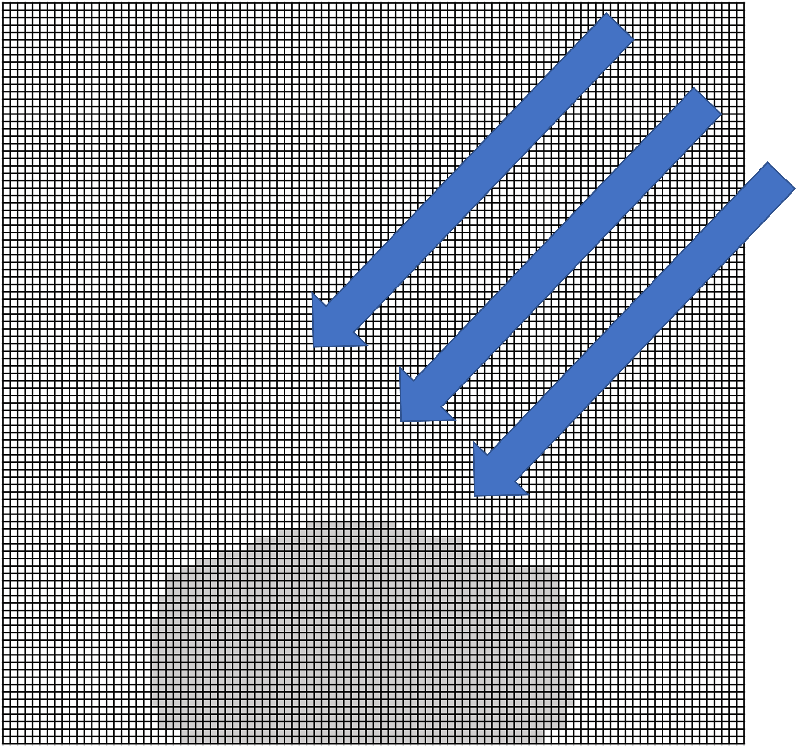

# Soap in the Tub

## Things to Build

In this project, you will create a model of a bar of soap stuck to the floor of your bathtub. As water rains down from your showerhead, the top layer of the soap is bombarded by drops and begins to erode. Water drops impact the surface of the soap at random velocities and masses.

You are free to construct your model using any language, libraries, solvers, hardware, etc. You are also free to choose the level of realism and areas of focus. For example, the project could focus on accurate physical simulation, interesting visualizations, high performance, or other aspects.

One possible approach is to model the soap in two dimensions: discretize the soap into a contiguous subset of cells in an `NxN` array. The following is an example of a bar of soap modeled in two dimensions on a `100x100` array, with incident water incoming from the upper right hand corner.

A possible output is a sequence of `NxN` arrays, each of which represents a distinct timestep in the simulation.

Some important questions to consider at the outset of your model construction are:

1. How are water drops encoded?
    1. How is the mass and velocity of each drop defined?
    2. Are drops modeled individually or in bulk?
    3. Does your model correctly identify collisions between water drops and soap cells?
2. What happens when a drop collides with a soap cell?
    1. Which physical effects are modeled (erosion, dissolution, evaporation...) and how are these encoded?
    2. Are these processes deterministic or stochastic?
3. How do adjacent soap cells interact when drops hit the outer surface?
4. As the number of incident water drops approaches infinity, in what state do you expect the soap to be?

There are no "correct" answers to those questions, and this is by design. This project is selected to give us insight into how you approach a generic Monte Carlo-esque simulation task. Specifically, we are excited to learn:

1. How do you approach a very generic simulation task?
    1. How do you represent physical phenomena in a simplified computational space?
    2. How well can you communicate your modeling choices?
2. What architectures or techniques do you weigh in constructing a model?
    1. There are many (correct) ways to complete this project, but why your way?
    2. How elegant or easy to parse is your code?
    3. What are the performance tradeoffs of your model construction?
3. How do you build a computer model from the ground up?
    1. What do you consider to be critical functionality to build and test first?
    2. What is a "nice to have"?
4. How do you evaluate the validity of each assumption you make?

## Things to Explore

Because there are no "test cases" for this project, there is no finish line for your model. This means you are free to explore the space of possible problems your model can solve. You can satisfy this part of the task in a number of ways, a subset of which are described below:

1. Evaluate and improve the performance of your model (i.e. for a given starting condition, improve the runtime to produce equivalent results OR robustness to larger inputs)
2. Explore different soap geometries and the rates at which they reach a steady state
3. Define a different water drop configurations. How does the soap behave in the configurations are deterministic? Stochastic? Do any produce chaotic responses in the soap?
4. Are there any water drop distributions which never produce a steady state? Are any of these realistic? Why or why not?
5. Test out different soap material properties. What happens when you change your drop-soap interaction or your soap-soap interaction? How do these choices affect the final steady state of the soap?

Above all, though, we are looking to see how you operate as a software engineer,so don't get bogged down by the infinite possibilities. Emphasize strong code construction over frilly features and explore something that interests you!
